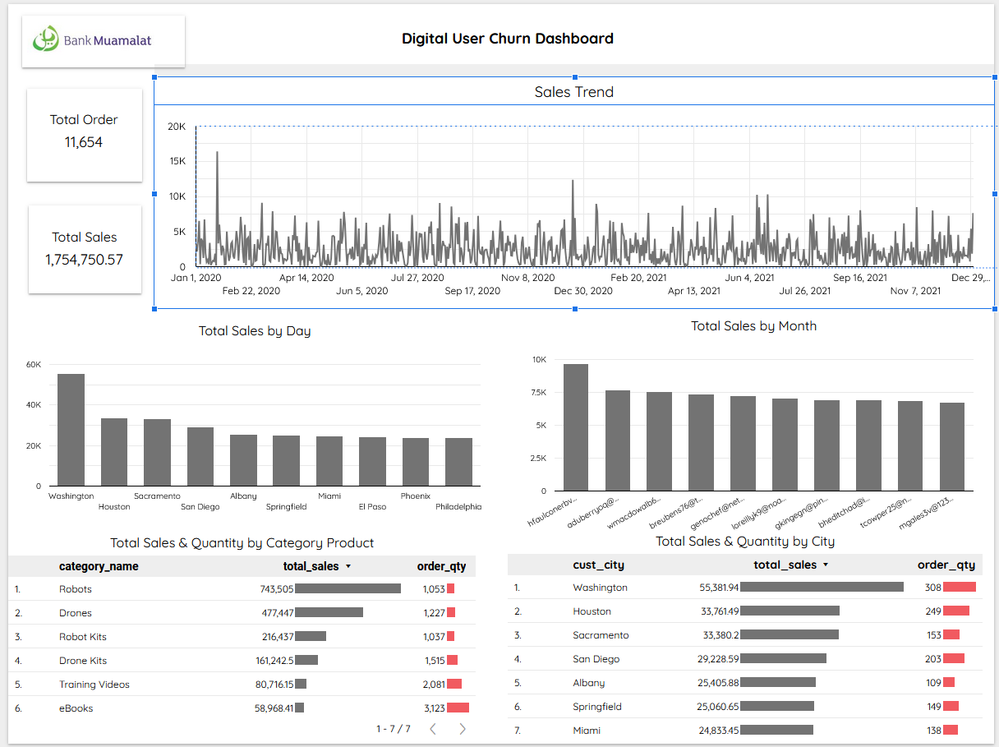

# Bank-Muamalat-BusinessIntelligence-Project
**Digital User Churn Dashboard**

## 📌 **Project Description**  
This project is a collaboration between **Bank Muamalat** and **Rakamin Academy** as part of the Business Intelligence Analyst training program. The goal is to develop an interactive dashboard to monitor and analyze digital user behavior, focusing on predicting and preventing churn (customer attrition).

## 🚀 **Project Objectives**
- Analyze digital user data from Bank Muamalat to identify churn patterns.  
- Develop an interactive dashboard that visually and intuitively displays information.  
- Provide data-driven recommendations to reduce churn rates and enhance user loyalty.  

## 🛠️ **Tools Used** 
- **Microsoft Excel**: For data cleaning and initial analysis.  
- **Big Query**: For data manipulation using SQL queries.  
- **Looker Studio**: For building interactive dashboards.  

## 🚀 **Dashboard Features**
- Visualization of churn rate over time, user segments, and contributing factors.  
- Key Performance Indicators (KPIs) such as active user count and retention ratio.  
- Interactive filters for in-depth data exploration.  

## 🔍 **Project Outcomes** 
- A dashboard capable of providing deep insights to the management team regarding churn patterns and factors.  
- Strategic recommendations based on data analysis to increase engagement and user retention.  

## 📊 **Dashboard Visualization**
Visualization Dashboard for this analysis can be accessed at [Digital User Churn Dashboard](https://lookerstudio.google.com/s/vNU6pdJfL_Q). 

